# 📊 Technical Documentation: Coin Circle App

This document provides a comprehensive technical breakdown of the **Coin Circle** application—a production-ready group savings (Digital Chit Fund) platform.

---

## 1. Wireframe Diagram (Low-Fidelity)
*Low-fidelity sketches of all app screens showing layout and navigation.*

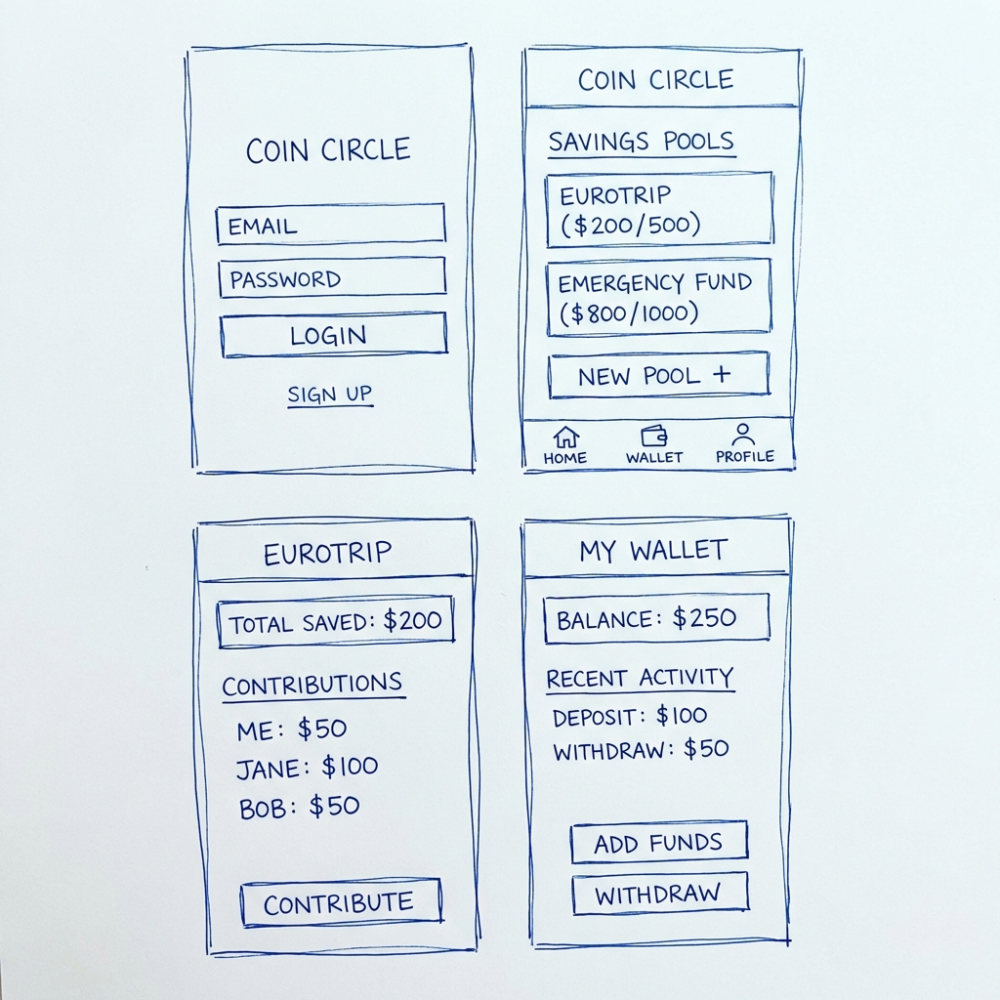

**Overview:**
- **Auth Flow**: Simple login/signup with email validation.
- **Dashboard**: Core hub for savings pools and wallet overview.
- **Pool Management**: Detail views for contribution history and member lists.
- **Wallet**: Interface for manual funding and withdrawal requests.

---

## 2. User Flow Diagram
*The step-by-step journey of a user interacting with the app's core features.*

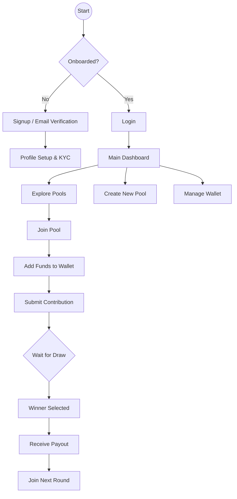

---

## 3. System Architecture Diagram
*The distributed infrastructure powering real-time financial collaboration.*

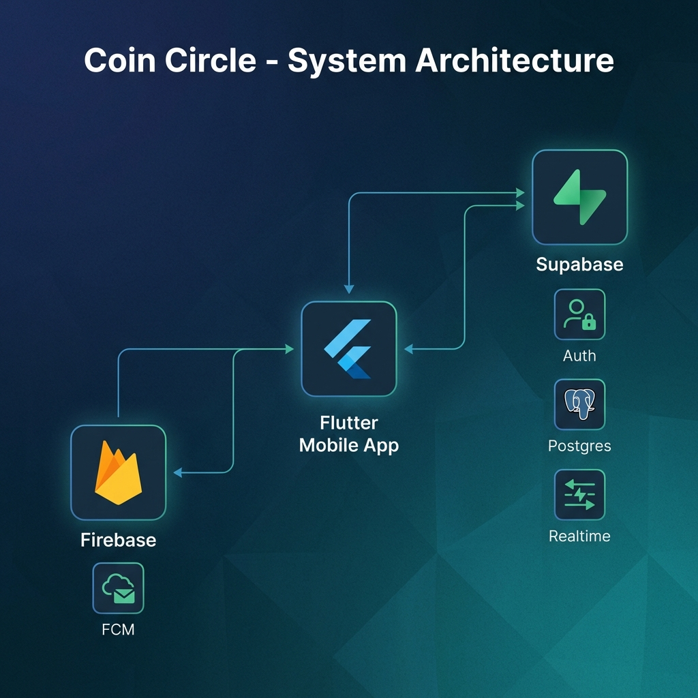

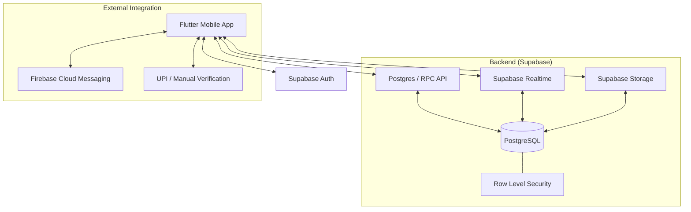

---

## 4. Database Schema Diagram
*Entities and relational constraints for secure financial auditing.*

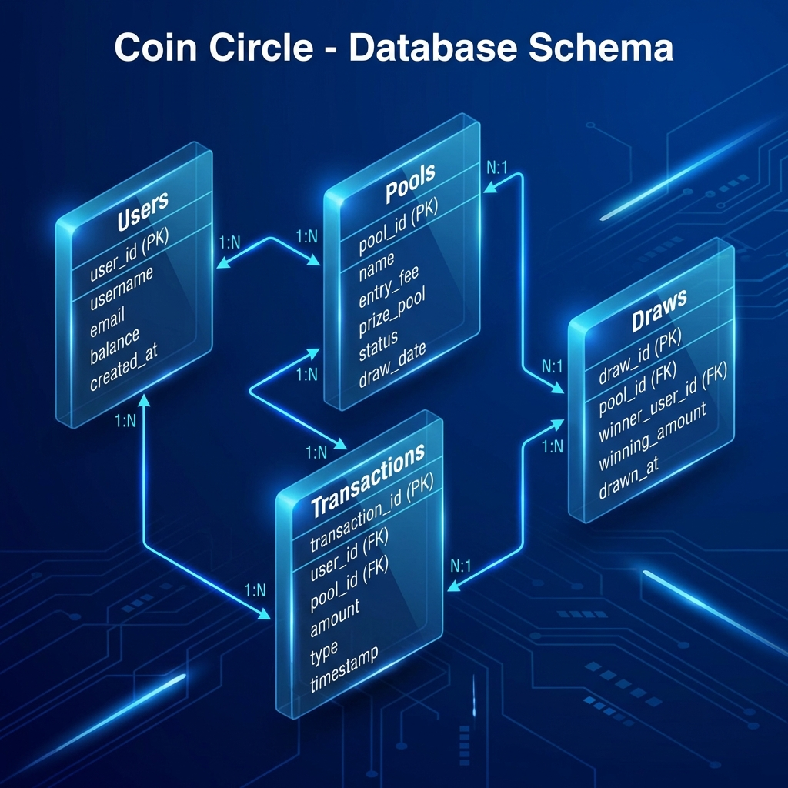

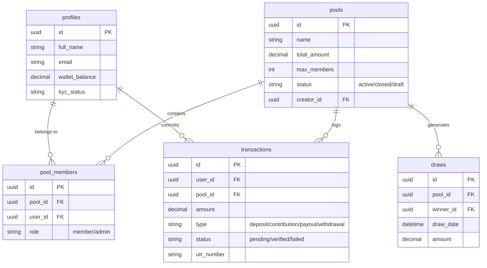

---

## 5. API Design Diagram
*Documenting core endpoints and database procedures.*

| Method | Endpoint / Function | Payload | Response |
| :-- | :-- | :-- | :-- |
| `POST` | `auth.signUp()` | `{email, password}` | `Session Object` |
| `GET` | `from('pools')` | `query filters` | `List<Pool>` |
| `RPC` | `create_pool` | `{name, amount, members}` | `uuid pool_id` |
| `RPC` | `join_pool` | `{pool_id, user_id}` | `Success/Error` |
| `RPC` | `process_payout` | `{pool_id, winner_id}` | `Audit Record` |
| `PUT` | `update_profile` | `{full_name, avatar_url}` | `Profile` |

---

## 6. UI/UX Mockup Diagram (High-Fidelity)
*Final visual design with premium styling, dark mode, and Material 3.*

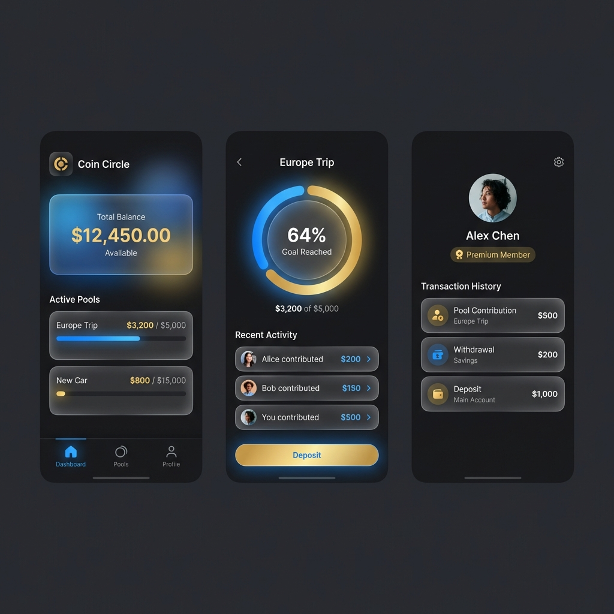

**Design Highlights:**
- **Gradients**: Deep blue to gold transitions.
- **Glassmorphism**: Translucent cards for pool stats.
- **Micro-interactions**: Smooth transitions between dashboard tiles.
- **Typography**: Clean sans-serif (Inter/Outfit) for readability.

---

## 7. Component Structure Diagram
*Frontend hierarchy following Clean Architecture principles.*

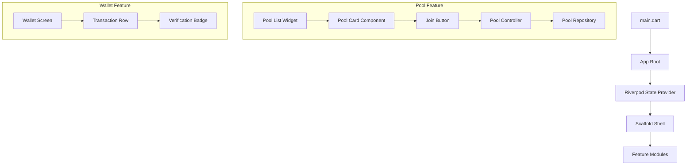

---

## 8. Data Flow Diagram
*How data travels through the app layers for a 'Deposit Funds' action.*

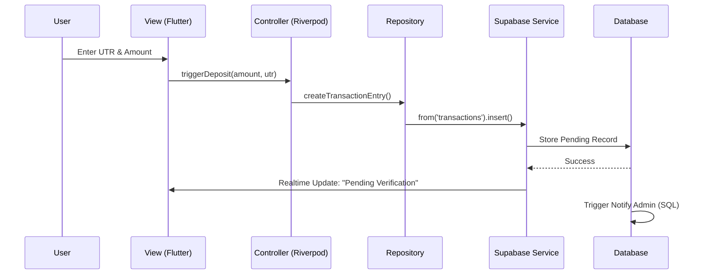

---

## 9. Deployment Architecture Diagram
*Production-ready infrastructure for global accessibility.*

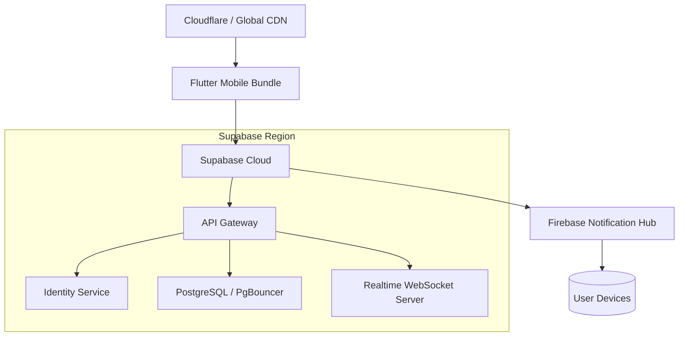

---

## 10. Technology Stack Diagram
*The modern tools powering the end-to-end experience.*

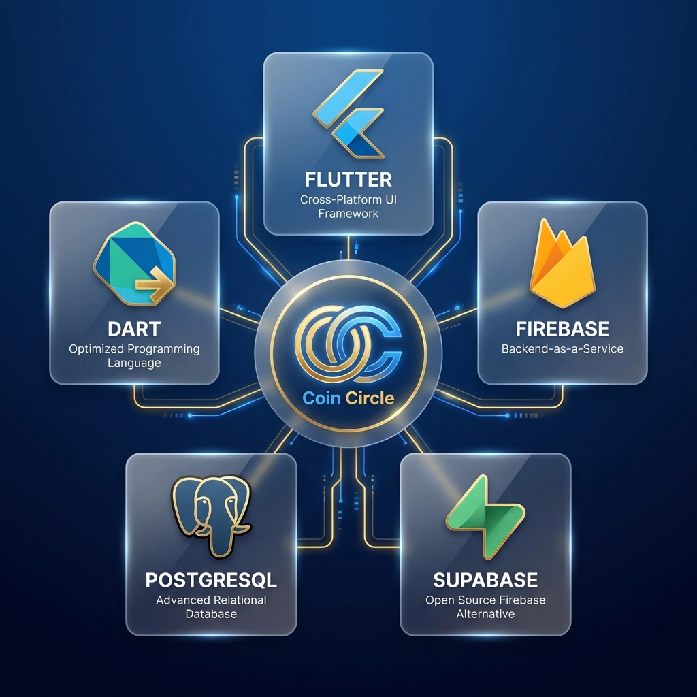

- **Frontend**: Flutter (Mobile), Dart (Logic)
- **State Mgmt**: Riverpod (Reactive state)
- **Database**: PostgreSQL (Relational storage)
- **Backend-as-a-Service**: Supabase
- **Real-time**: Supabase Realtime (WebSockets)
- **File Storage**: Supabase Storage (Identity-based)
- **Push Notifications**: Firebase Cloud Messaging
- **Security**: PostgreSQL RLS & Vault
- **Infrastructure**: GitHub Actions (CI/CD)

---
